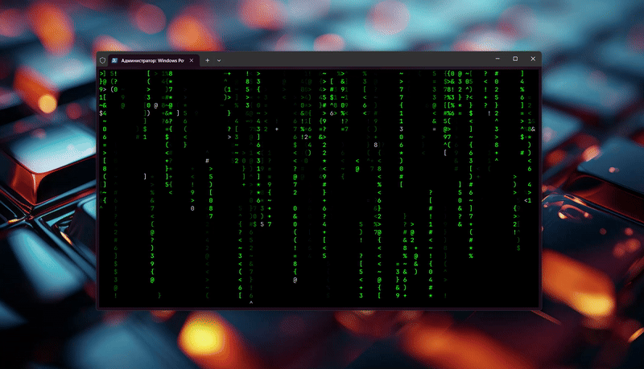

<video src="https://github.com/user-attachments/assets/0cd1d273-f355-4688-b95b-aec73f59f4d8" width=600" /></video>

### Powershell Matrix simulator

### How to Run on Windows 11

1) Download and save [pmatrix.ps1](https://github.com/yojeero/pmatrix/blob/main/pmatrix.ps1) or just clone this repo using `git clone https://github.com/yojeero/pmatrix`

2) Right click on file **pmatrix.ps1** - "Run with PowerShell" or [cmatrix.ps1](https://github.com/yojeero/pmatrix/blob/main/cmatrix.ps1) for classic variant.



3) Enjoy!

```
The matrix effect on Windows through `PowerShell` with transparent Terminal.
```

```ps1
class Glyph {
    [int]$LastPosition
    [int]$CurrentPosition
    [int]$Velocity
    [int]$Intensity
    [double]$IntensityChange
    [char]$Current
    [char]$Last
    
    Glyph() {
        $this.Setup()
    }

    [void]Setup()
    {
        $this.CurrentPosition = $script:rand.Next(-$script:ScreenHeight,.6*$script:ScreenHeight)
        $this.Velocity = 1
        $this.Intensity=0
        $this.IntensityChange = ($script:rand.Next(1,20)/100)
        $this.Current=$script:PossibleGlyphs[$script:rand.Next($script:glyphCount+1)]
        $this.Last=$script:PossibleGlyphs[$script:rand.Next($script:glyphCount+1)]
        
    }

    [void]Move() {
        $this.LastPosition=$this.CurrentPosition
        $this.Intensity+=[Math]::Floor(255*$this.IntensityChange)
        if ($this.Intensity -gt 255){$this.Intensity = 255}

        $this.CurrentPosition+=$this.Velocity
        
        $this.Last = $this.Current
        if ($this.Current -ne ' '){$this.Current=$script:PossibleGlyphs[$script:rand.Next($script:glyphCount+1)]}
        
        #out of bounds
        if ($this.CurrentPosition -gt $script:ScreenHeight -1)
        {
            $this.Setup()

        }
    }
}

function Blank-Screen()
{
    $line="$script:e[38;2;0;0;0m$script:e[48;2;0;0;0m" + "".PadLeft($script:ScreenWidth,".")
    
    for ($l = 0;$l -lt $script:ScreenWidth;$l++)
    {
        Write-Host -NoNewline $line
    }
}

$script:rand = [System.Random]::new()
$script:ScreenWidth=$host.UI.RawUI.WindowSize.Width
$script:ScreenHeight=$host.UI.RawUI.WindowSize.Height

[char[]]$script:PossibleGlyphs="   +=1234567890!@#$%^&*()<>?{}[]<>~".ToCharArray() 
$glyphCount = $script:PossibleGlyphs.Count

$script:e=[char]27 #escape

#create array of glyphs, one for each column
[Glyph[]]$AllGlyphs=[Glyph[]]::new($script:ScreenWidth)
for ($i=0;$i -lt $AllGlyphs.Count;$i++)
{
    $AllGlyphs[$i]=[Glyph]::new()
}

#hide the cursor and capture the 
[Console]::CursorVisible=$false
$originalBG = [Console]::BackgroundColor
$originalFG = [Console]::ForegroundColor
#$originalOE = [Console]::OutputEncoding

#Blank-Screen
Write-Host "$e[38;5;16m$e[48;5;16m$e[H$e[Jm" -NoNewline 

$stopwatch =[System.Diagnostics.Stopwatch]::StartNew()

#loop until a key is pressed
while (-not [System.Console]::KeyAvailable)
{
    if ($stopwatch.Elapsed.TotalMilliseconds -gt 33.33)
    {
        #loop through each glyph and move it
        for ($i = 0; $i -lt $script:ScreenWidth;$i++)
        {
            $AllGlyphs[$i].Move()

            #draw the 'leader'
            if ($AllGlyphs[$i].CurrentPosition -ge 0)
            {
                [Console]::CursorLeft=$i
                [Console]::CursorTop=[Math]::Floor($AllGlyphs[$i].CurrentPosition)
                [Console]::Write("$e[48;2;0;0;0;0m$e[38;5;15m$($AllGlyphs[$i].Current)")            
            }

            #draw the 'faint' trail
            if ($AllGlyphs[$i].LastPosition -ge 0)
            {
                [Console]::CursorLeft=$i
                [Console]::CursorTop=[Math]::Floor($AllGlyphs[$i].LastPosition)
                [Console]::Write("$e[48;2;0;0;0;0m$e[38;2;255;$($AllGlyphs[$i].Intensity);255m$($AllGlyphs[$i].Last)")
            }
        }

        $stopwatch.Restart()
    }

}

#set the console colors back
[Console]::BackgroundColor = $originalBG
[Console]::ForegroundColor = $originalFG

#disregard the keystroke that was pressed to exit the loop
$null = [Console]::ReadKey($true)

#take us back home
Clear-Host
```
